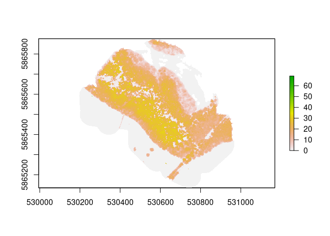
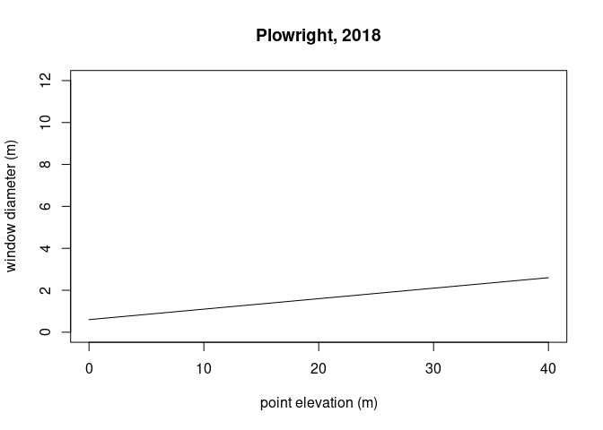
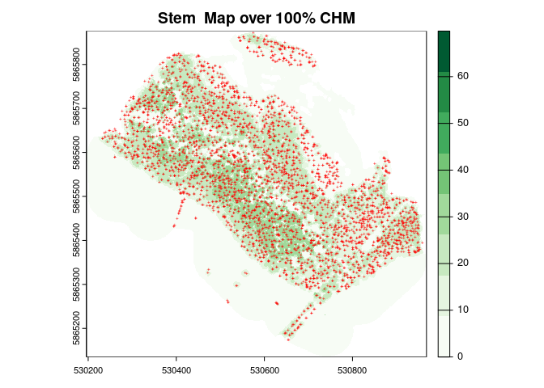

Ash-Dieback Stem Detection
================
Vertinetik-SM
2023-09-23

- [Classify Normalise Rasterize](#classify-normalise-rasterize)
- [Variable Window Function](#variable-window-function)

## Classify Normalise Rasterize

<!-- -->

``` r
#Visualize
defaultCRS<-CRS("+init=EPSG:3857")
las_tile = readLAS("/media/seamus/USB1/Shavington/clouda340d379a59ddadf.las", select = 'xyzcr', filter = '-drop_class 19')
#Classify ground & noise
las_tile_csf = classify_ground(las_tile, csf(sloop_smooth=TRUE, 0.5, 1))
#las_tile_csf_so = classify_noise(las_tile_csf, sor(k=10, m=3))
#Clean noise
las_tile_csf_norm = normalize_height(las_tile_csf, knnidw())
#Clean overlaps
#las_tile_chm_so_norm_clean = filter_duplicates(las_tile_csf_so_norm)
#Rasterize
las_tile_chm = grid_canopy(las_tile_csf_norm, 1, dsmtin(8))
#plot(las_tile_chm, col = height.colors(50))

writeRaster(las_tile_chm, filename = "/media/seamus/USB1/Shavington/lead_htop_raster.tif", overwrite=TRUE)
plot(las_tile_chm)
```

## Variable Window Function

``` r
kernel <- matrix(1,3,3)
wf_plowright<-function(x){ 
  a=0.05
  b=0.6 
  y<-a*x+b 
  return(y)}
heights <- seq(0,40,0.5)
window_plowright <- wf_plowright(heights)
plot(heights, window_plowright, type = "l", ylim = c(0,12), xlab="point elevation (m)", ylab="window diameter (m)", main='Plowright, 2018')

las_tile_chm_smooth = focal(las_tile_chm, w = kernel, fun = median, na.rm = TRUE) 
ttops_1.5mfloor_plowright = ForestTools::vwf(las_tile_chm_smooth, wf_plowright, 1.5)
#ttops_1.5mfloor_plowright = ForestTools::vwf(CHM = las_tile_chm_smooth, winFun = wf_plowright, minHeight = 2)
ttops_1.5mfloor_plowright_sp = as_Spatial(ttops_1.5mfloor_plowright)
writeOGR(ttops_1.5mfloor_plowright_sp, "/media/seamus/USB1/Shavington", "ttops_1.5mfloor_plowright_sp", driver = "ESRI Shapefile") 
```

<!-- -->

    ## Reading layer `ttops_1.5mfloor_plowright_sp' from data source 
    ##   `/media/seamus/USB1/Shavington/ttops_1.5mfloor_plowright_sp.shp' 
    ##   using driver `ESRI Shapefile'
    ## Simple feature collection with 4016 features and 3 fields
    ## Geometry type: POINT
    ## Dimension:     XY
    ## Bounding box:  xmin: 530232.5 ymin: 5865174 xmax: 530958.5 ymax: 5865872
    ## Projected CRS: WGS 84 / UTM zone 30N

<!-- -->

    ##      treeID         height         winRadius               geometry   
    ##  Min.   :   1   Min.   : 1.531   Min.   :0.6765   POINT        :4016  
    ##  1st Qu.:1005   1st Qu.:16.882   1st Qu.:1.4441   epsg:32630   :   0  
    ##  Median :2008   Median :22.177   Median :1.7088   +proj=utm ...:   0  
    ##  Mean   :2008   Mean   :20.968   Mean   :1.6484                       
    ##  3rd Qu.:3012   3rd Qu.:26.424   3rd Qu.:1.9212                       
    ##  Max.   :4016   Max.   :34.566   Max.   :2.3283
